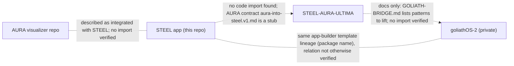

# 3XTRINITY factory (FORGE / SERPENT / CITADEL)

Registry **definitions** plus a small dependency-free dispatcher. Nothing here is 150 running agents.

| Term | Meaning in this repo |
|---|---|
| DEFINED | a worker row exists in `factory-registry.json` (150: FORGE 001-050, SERPENT 051-100, CITADEL 101-150) |
| AVAILABLE | the worker declares a capability AND real handler code is registered for it in the dispatcher |
| ACTIVE / SLEEPING / BLOCKED | current `state` of the worker row (default SLEEP) |
| EXECUTED_TASKS | sum of `completed_tasks`; a definition is worth zero |

States: `SLEEP -> READY -> ACTIVE -> VERIFY -> DONE -> SLEEP`, `ACTIVE -> BLOCKED -> SLEEP`.
Two edges beyond the brief keep the machine closed: `DONE -> SLEEP` and `VERIFY -> BLOCKED`. Everything else is rejected and logged.

## Current counts (as of branch `factory/handlers-and-debt`, PR #52; reproduce with `npm run factory -- status`)

| Metric | Value | Notes |
|---|---|---|
| DEFINED | 150 | FORGE 50 / SERPENT 50 / CITADEL 50 |
| AVAILABLE | **20** | 20 workers (23 capability tokens) with handler code registered; the other **130 are DEFINED only** |
| ACTIVE / SLEEPING / BLOCKED | 0 / 150 / 0 | every worker is at rest |
| EXECUTED_TASKS | **24** | all from the two committed closed loops (`factory-receipts.json`: 2 loops, both ADMIT); 24 queue tasks DONE, 0 failed |
| Executed by the 9 handler workers | 0 | handlers exist and are tested, but no handler task has been run and recorded in the registry yet |

AVAILABLE means handler code plus a capability, not "has done work". It comes from two sources in `capabilities.ts`:

**Closed-loop workers (11)**, handlers in `loop.ts` / `kratt-stage.ts` / `rastik-attacks.ts` / `toepara.ts` / `cerberus-gate.ts`:

| Worker | Capabilities |
|---|---|
| FORGE-026 KRATT Engineer | `kratt:hash-files`, `kratt:validate-manifest`, `kratt:run-test` |
| SERPENT-051 RÄSTIK Commander | `rastik:run-probes` |
| SERPENT-052 Input Fuzzer | `rastik:attack:invalid-input` |
| SERPENT-053 Boundary Tester | `rastik:attack:boundary` |
| SERPENT-056 Schema Breaker | `rastik:attack:malformed-receipt` |
| SERPENT-060 Replay Tester | `rastik:attack:stale-base-sha`, `rastik:attack:replay` |
| SERPENT-062 Authorization Tester | `rastik:attack:unauthorized-action` |
| SERPENT-064 Evidence Tester | `rastik:attack:missing-evidence` |
| SERPENT-065 Digest Tester | `rastik:attack:tampered-evidence` |
| CITADEL-101 TÖEPÄRA Commander | `toepara:verify` |
| CITADEL-111 CERBERUS Commander | `cerberus:decide` |

**Read-only analysis handlers (9)**, in `handlers/`; each has a contract (`Contract` in `handlers/types.ts`) and a behavioural test in `tests/handlers-analysis.test.ts`.
They read git objects at the task's `base_sha` only (no working tree, no writes, no network, no env), emit an `UNVERIFIED` receipt, and run through `runHandlerTask` in the dispatcher:

| Worker | Capability | Checks |
|---|---|---|
| FORGE-002 Repository Mapper | `repo:map-tree` | file/byte inventory, extension and top-dir histograms, symlinks/submodules |
| FORGE-003 Dependency Mapper | `deps:map-package` | package.json specifier classes; wildcard, git/URL, duplicate entries |
| FORGE-014 Schema Engineer | `schema:validate-json` | JSON Schema (draft-07 subset; unsupported keywords and unsafe patterns fail closed) |
| FORGE-049 Documentation-from-Code Agent | `docs:check-links` | relative Markdown links and `#anchors` against the same commit |
| SERPENT-066 Artifact Integrity Tester | `artifact:verify-manifest` | files re-hashed against a committed manifest |
| SERPENT-068 Supply-Chain Reviewer | `supply-chain:review-lockfile` | install scripts, git/http/foreign-registry sources, deprecations |
| SERPENT-069 Secret Exposure Reviewer | `secrets:scan-files` | credential shapes (reports a fingerprint, never the secret) |
| SERPENT-078 Package-Lock Auditor | `lockfile:audit-integrity` | SRI presence, format and digest length; root dependencies locked |
| CITADEL-104 Evidence Hasher | `evidence:hash-blobs` | deterministic per-file SHA-256 and manifest digest |

A new handler becomes AVAILABLE only by being added to `HANDLERS` in `handlers/index.ts`; the coverage-gate test then fails until it has a behavioural test, and `registry.test.ts` / `loop.test.ts` pin the total (20).

Files: `roles.ts` (frozen role names), `registry.ts` (types, init + shape validation), `dispatcher.ts` (state machine, queue, watchdog), `capabilities.ts` (the capability map that decides AVAILABLE), `handlers/` (read-only analysis handlers),
`protocol/` (protocol v1: TaskEnvelope, ActionReceipt, EvidenceBundle, RastikFinding, ToeparaVerdict, CerberusDecision; one spec drives the validators and the generated `protocol.schema.json`),
`factory-baseline.json` (repo reconciliation), `factory-*.json` (registry/queue/receipts/matrix state).
CLI: `npm run factory -- init|validate|status|run-loop`.

## Cross-repo dependency graph (only what was verified)

Dashed edges are documentation or naming relations, not code dependencies. GitLab: EXTERNAL_CONNECTOR_BLOCKED (nothing read).

## STEEL <-> AURA contract

The only written contract file is `STEEL-AURA-ULTIMA/docs/contracts/aura-into-steel.v1.md`, whose entire content is
"scaffold stub; not implemented". STEEL has its own in-repo AURA UI (`src/lib/aura/store.ts`, `src/components/aura-stage.tsx`) and does not import AURA packages
(`package.json` has no `steel-aura`/`aura-viz` dependency). No contract is implemented in code, so none is documented here.
AURA does ship a tested journal contract (`FrequencyPatternJournal`, `packages/aura-viz/scripts/frequencyPatternJournal.test.mjs`, 4 cases; read by `apps/aurora-borealis-ultima/src/readJournal.test.ts`), which is AURA-internal.

## GOLIATH

No GOLIATH control-plane specification exists in STEEL, STEEL-AURA-ULTIMA or goliathOS-2. This directory therefore defines **no** GOLIATH service; `GOLIATH-STAND-IN` code (when present) is a typed in-process caller and is not the real GOLIATH.
