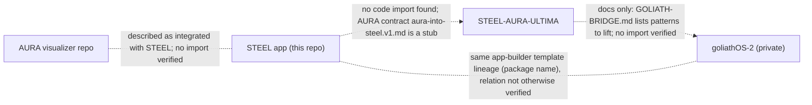

# 3XTRINITY factory (FORGE / SERPENT / CITADEL)

Registry **definitions** plus a small dependency-free dispatcher. Nothing here is 150 running agents.

| Term | Meaning in this repo |
|---|---|
| DEFINED | a worker row exists in `factory-registry.json` (150: FORGE 001-050, SERPENT 051-100, CITADEL 101-150) |
| AVAILABLE | the worker declares a capability AND real handler code is registered for it in the dispatcher |
| ACTIVE / SLEEPING / BLOCKED | current `state` of the worker row (default SLEEP) |
| EXECUTED_TASKS | sum of `completed_tasks`; a definition is worth zero |

States: `SLEEP -> READY -> ACTIVE -> VERIFY -> DONE -> SLEEP`, `ACTIVE -> BLOCKED -> SLEEP`.
Two edges beyond the brief keep the machine closed: `DONE -> SLEEP` and `VERIFY -> BLOCKED`. Everything else is rejected and logged.

Files: `roles.ts` (frozen role names), `registry.ts` (types, init + shape validation), `dispatcher.ts` (state machine, queue, watchdog),
`protocol/` (protocol v1: TaskEnvelope, ActionReceipt, EvidenceBundle, RastikFinding, ToeparaVerdict, CerberusDecision; one spec drives the validators and the generated `protocol.schema.json`),
`factory-baseline.json` (repo reconciliation), `factory-*.json` (registry/queue/receipts/matrix state).
CLI: `npm run factory -- init|validate|status`.

## Cross-repo dependency graph (only what was verified)

Dashed edges are documentation or naming relations, not code dependencies. GitLab: EXTERNAL_CONNECTOR_BLOCKED (nothing read).

## STEEL <-> AURA contract

The only written contract file is `STEEL-AURA-ULTIMA/docs/contracts/aura-into-steel.v1.md`, whose entire content is
"scaffold stub; not implemented". STEEL has its own in-repo AURA UI (`src/lib/aura/store.ts`, `src/components/aura-stage.tsx`) and does not import AURA packages
(`package.json` has no `steel-aura`/`aura-viz` dependency). No contract is implemented in code, so none is documented here.
AURA does ship a tested journal contract (`FrequencyPatternJournal`, `packages/aura-viz/scripts/frequencyPatternJournal.test.mjs`, 4 cases; read by `apps/aurora-borealis-ultima/src/readJournal.test.ts`), which is AURA-internal.

## GOLIATH

No GOLIATH control-plane specification exists in STEEL, STEEL-AURA-ULTIMA or goliathOS-2. This directory therefore defines **no** GOLIATH service; `GOLIATH-STAND-IN` code (when present) is a typed in-process caller and is not the real GOLIATH.
